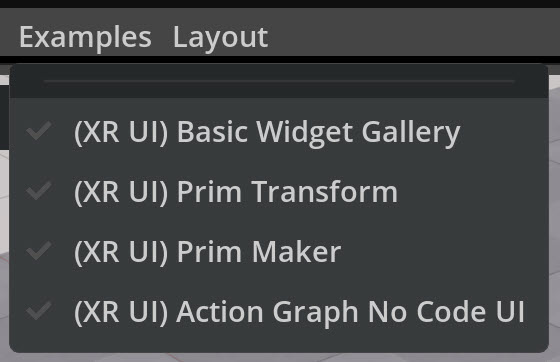
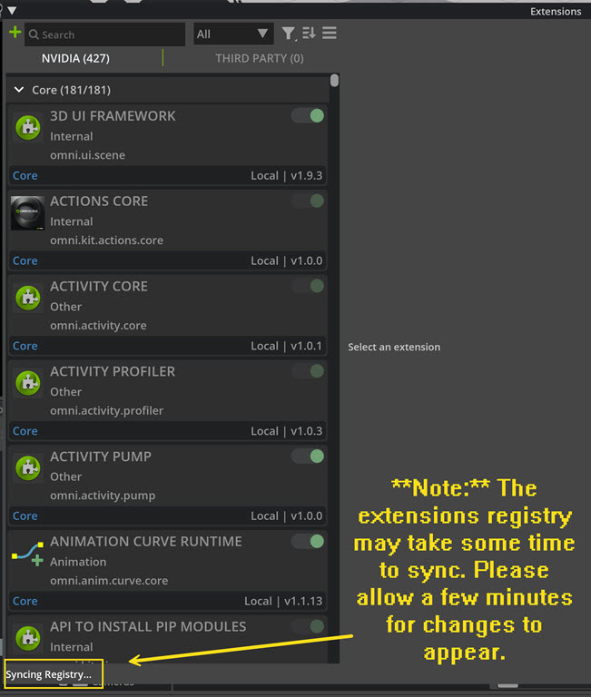
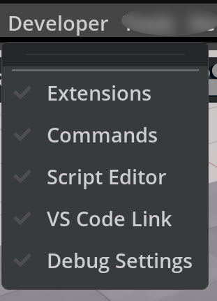

# Kit XR Samples Extensions

## Overview
This repository provides instructions for building and integrating the Kit XR Samples extensions with your Kit-App-Template project. The samples repository will evolve over time with new and updated samples.

## Table of Contents
- [Kit XR Samples Extensions](#kit-xr-samples-extensions)
  - [Overview](#overview)
  - [Table of Contents](#table-of-contents)
  - [Kit XR Samples](#kit-xr-samples)
  - [Prerequisites](#prerequisites)
  - [Building the Extensions](#building-the-extensions)
  - [Launching and Testing](#launching-and-testing)
    - [Additional Commands](#additional-commands)
  - [License](#license)
  - [Additional Resources](#additional-resources)
  - [Contributing](#contributing)

## Kit XR Samples

This repo contains sample extensions built for Kit XR:
- USD-Based SceneUI Sample

  

## Prerequisites
Requires a kit-app-template application

## Building the Extensions

Follow this step to clone the Kit XR Samples extension:

**Step 1: Clone the Repo**  
Clone the repo using SSH or HTTPS, preferably in the same location as your `kit-app-template` folder.

Using SSH:  
`git clone --recurse-submodules ssh://git@github.com:NVIDIA-Omniverse/kit-xr-samples.git`

Using HTTPS:  
`git clone --recurse-submodules https://github.com/NVIDIA-Omniverse/kit-xr-samples.git`

## Launching and Testing

Launch a Kit application by including command line arguments in the launch procedure to load the `kit-xr-samples` extension. This setup allows you to access the XR samples during your Kit application session.

**Make sure to replace `{name of kit template file}` with your own app name located within this folder:**  
`~\kit-app-template\_build\windows-x86_64\release`

**Similarly, make sure to replace `{kit-xr-samples cloned directory}` with the directory where you cloned the kit-xr-samples repo**

For SceneUI:  
`_build\windows-x86_64\release\{name of kit template file}.kit.bat --ext-folder {kit-xr-samples cloned directory}\source\extensions --enable omni.kit.xr.samples.usd_scene_ui`

### Additional Commands

Everything we do with command line arguments can also be set in the .kit file to simplify the launch process. 

Here is a list of additional useful commands:

- If you want to include the extensions manager, add the following command:  
  `--enable omni.kit.window.extensions`

  

- If you want to enable developer mode, add the following command:  
  `--enable omni.kit.developer.bundle`
  
  

## License

NVIDIA Omniverse is governed by the [NVIDIA Agreements | Enterprise Software | NVIDIA Software License Agreement](https://www.nvidia.com/en-us/agreements/enterprise-software/nvidia-software-license-agreement) and [NVIDIA Agreements | Cloud Services | Service-Specific Terms for NVIDIA Omniverse Cloud](https://www.nvidia.com/en-us/agreements/cloud-services/service-specific-terms-for-omniverse-cloud/). By downloading or using NVIDIA Omniverse, you agree to the NVIDIA Omniverse terms.

## Additional Resources

For more information on using Omniverse Kit and USD, please visit the following resources:

- [Omniverse Kit App Template](https://github.com/NVIDIA-Omniverse/kit-app-template)
- [Omniverse Kit SDK Manual](https://docs.omniverse.nvidia.com/kit/docs/kit-manual/latest/index.html)
- [Omniverse Kit Extensions Documentation](https://docs.omniverse.nvidia.com/kit/docs/kit-manual/latest/guide/extensions_advanced.html)
- [Omniverse Developer Documentation](https://developer.nvidia.com/nvidia-omniverse-platform)
- [USD Documentation](https://graphics.pixar.com/usd/release/)

## Contributing

We provide this source code as-is and are currently not accepting outside contributions.

